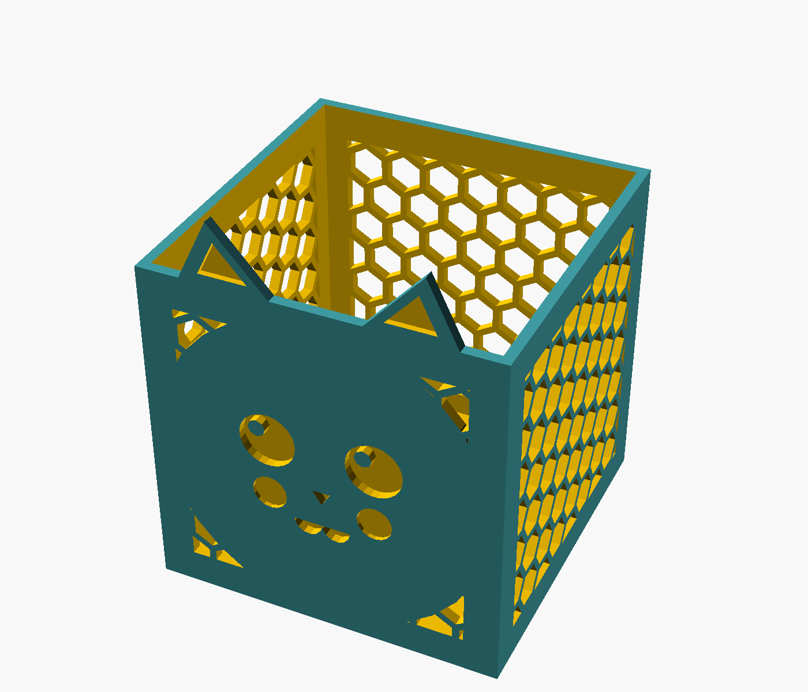

# Cat Basket

Open-top square basket — 10 × 10 × 10 cm — with a chibi cat face on a solid
circular head disk centered on the front wall, two pointy ears poking up
above the front rim, and a honeycomb cutout pattern wrapping around the
head and across the three other walls (see-through, lighter, and easier on
filament). Holds desktop clutter, hair ties, cat treats, AA batteries —
anything that fits in a ~9 cm cube and benefits from a cat watching over it.



## What gets printed

One piece. Print upright (bottom on the bed, walls going up, open top facing
up). The face engravings are recessed into the front wall, so there are no
overhangs — vertical walls all the way up.

| Dimension | Value |
|---|---|
| Outer cube                       | 100 × 100 × 100 mm |
| Wall thickness                   | 3 mm |
| Floor thickness                  | 3 mm |
| Interior usable volume           | 94 × 94 × 97 mm |
| Ear height above rim             | 18 mm (so total height ≈ 118 mm at the front) |
| Cat face engrave depth           | 2 mm into the wall |
| Inner ear engrave depth          | 1.2 mm |
| Honeycomb hex width              | 10 mm flat-to-flat (all four walls) |
| Honeycomb web thickness          | 2 mm between hexes |
| Honeycomb border                 | 10 mm unbroken around each hex panel (keeps corners + rim + floor strong) |
| Head disk radius                 | 45 mm — dominates the front wall, hex pattern only peeks through at the four corners |
| Head disk border                 | 2 mm extra solid around the disk before hex pattern starts |

Footprint on the bed: 100 × 100 mm. Fits any consumer FDM printer with room
to spare.

## Print settings

PLA, no supports. The interior is hollow, but the walls themselves are solid
so infill % barely matters (the slicer fills the wall with perimeters).

| Setting | Value |
|---|---|
| Filament      | PLA (single color, or paint the recessed face afterward) |
| Layer height  | 0.2 mm |
| Walls         | 3 (the wall thickness will be all perimeters anyway) |
| Top / bottom  | 4 / 3 |
| Infill        | 15% (only the floor really uses it) |
| Supports      | **None** — everything is vertical or recessed |
| Brim          | Optional — the 100 × 100 bottom adheres fine without one |

Print time on a Bambu Lab X2C with 0.2 mm layers: ~5–7 hours (it's a big
piece — most of the time is spent on the walls).

## Tuning parameters

Top of [`cat-basket.scad`](cat-basket.scad), grouped for the OpenSCAD Customizer:

| Section | What to change |
|---|---|
| `[Basket]`              | `basket_size`, wall + floor thickness |
| `[Cat ears]`            | Ear height/width/spacing, tilt, whether to engrave inner ears |
| `[Honeycomb cutouts]`   | `hex_width`, `hex_web` (web thickness), `hex_margin` (border around the pattern). Set `hex_width = 0` to disable. |
| `[Cat head]`            | `head_circle_r` (size of the solid head disk on the front), `head_circle_border` (gap to the surrounding hex pattern) |
| `[Cat face engraving]`  | Face center height on the wall, eye/nose/mouth/blush sizes and positions, engrave depths |

## Export commands

```bash
SCAD="/Applications/OpenSCAD.app/Contents/MacOS/OpenSCAD"
F=models/cat-basket/cat-basket.scad
D=models/cat-basket/exports

"$SCAD" -o "$D/cat-basket.stl" "$F"

# Hero 3/4 view (auto-fit)
"$SCAD" --render -o "$D/cat-basket-3q.png" --imgsize=1400,1200 \
  --colorscheme=Tomorrow --viewall "$F"

# Front ortho — square basket with ears + face
"$SCAD" --render -o "$D/cat-basket-front.png" --imgsize=1200,1400 \
  --colorscheme=Tomorrow --viewall \
  --camera=50,50,59,90,0,0,300 --projection=ortho "$F"
```
