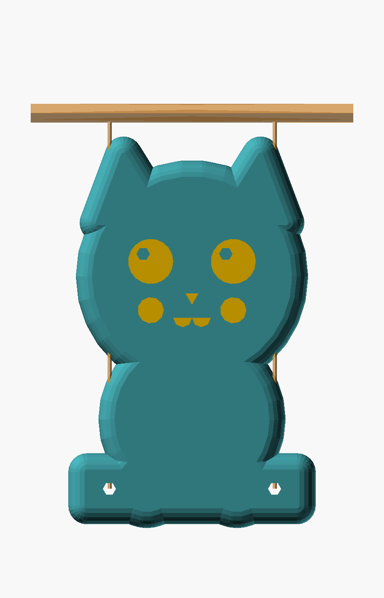

# Cat Swing

A super-cute chibi cat sitting on a swing plank. Chubby 3D round body (minkowski-puffed
silhouette), big sparkle eyes, blush cheeks, ω mouth, dangling paws hanging over the
seat. Prints as a single piece, flat on its back. You thread two pieces of string
through the holes in the seat and hang it from any horizontal support — a door
frame, a shelf bracket, a desk lamp arm, a stretched-out cardboard tube between
two stacks of books, etc.



## What gets printed

One piece. Lays flat on the bed with its flat back face down — the rounded chibi
front faces up, so the face engravings (eyes/nose/mouth/blush) sit on top of the
print, fully visible from above.

| Dimension | Value |
|---|---|
| Width                          | ~74 mm (seat + ear puff) |
| Height                         | ~98 mm (seat bottom → puffed ear tip) |
| Depth (height above bed)       | ~16 mm |
| String hole diameter           | 3.5 mm |

Footprint on the bed: ~74 × 98 mm. Print height: ~16 mm. Fits any consumer FDM
printer with room to spare.

## Print settings

PLA, no supports, no brim. The full silhouette sits on the bed so adhesion is
trivial.

| Setting | Value |
|---|---|
| Filament      | PLA (any color — try cat-appropriate ones) |
| Layer height  | 0.2 mm (drop to 0.16 mm for smoother face curves) |
| Walls         | 3 |
| Top / bottom  | 4 / 3 |
| Infill        | 15% (gyroid or grid — it's a toy, no structural load) |
| Supports      | **None** — the chibi roundness has gentle overhangs FDM handles fine |
| Brim          | Not needed |

Print time on a Bambu Lab X2C with 0.2 mm layers: ~1.5–2 hours.

For a multi-color print: pause at the eye/blush layer to swap to white (eye
sparkles), pink (blush), black (eye recess) — or just paint the recesses
afterward with acrylic markers.

## Assembly

You need: ~300 mm of thin string. Twine, embroidery floss, waxed cord, or
thin paracord all work — anything ≤ ~3 mm that fits through the holes.

1. Cut two pieces of string, ~150 mm each.
2. Thread one end of each through a seat hole (one per side).
3. Tie a knot on the underside so the string can't pull back out.
4. Tie the other ends to whatever you're hanging it from. For best swing motion,
   the two attachment points should be at roughly the same height and
   ~70–100 mm apart — like a real swing's two ropes going up to a horizontal bar.
   A single attachment point also works but the swing will rotate and wobble
   instead of swinging cleanly.
5. Push the cat. Watch it swing.

## Tuning parameters

Top of [`cat-swing.scad`](cat-swing.scad), grouped for the OpenSCAD Customizer:

| Section | What to change |
|---|---|
| `[Head]`             | `head_r`, ear size/separation, ear tilt |
| `[Body]`             | `body_r`, how deep the head sinks into the body |
| `[Paws]`             | Paw size/separation, vertical position, or hide entirely |
| `[Seat]`             | Plank `seat_width` and `seat_thickness`; how deep the body sinks into the seat |
| `[String holes]`     | Hole diameter (open up for thicker rope), inset from seat ends |
| `[3D body]`          | `flat_base` + `puff_r` control how chunky/round the cat is; `puff_fn` is render quality |
| `[Face engraving]`   | Eye size + sparkle, nose, mouth, blush size + separation, engrave depths |
| `[Output mode]`      | `"print"` / `"upright"` / `"assembly"` |

## Export commands

Working STL (ready to slice):

```bash
"/Applications/OpenSCAD.app/Contents/MacOS/OpenSCAD" \
  -o models/cat-swing/exports/cat-swing.stl \
  models/cat-swing/cat-swing.scad
```

Preview renders:

```bash
SCAD="/Applications/OpenSCAD.app/Contents/MacOS/OpenSCAD"
F=models/cat-swing/cat-swing.scad
D=models/cat-swing/exports

# Silhouette (front, ortho)
"$SCAD" --render -o "$D/cat-swing-silhouette.png" --imgsize=900,1400 \
  --colorscheme=Tomorrow --camera=0,46,0,0,0,0,300 --projection=ortho "$F"

# Assembly preview (cat hanging from strings + crossbar; the strings and bar
# are visual only, you supply them in real life)
"$SCAD" --render -o "$D/cat-swing-assembly.png" --imgsize=900,1400 \
  --colorscheme=Tomorrow -D 'output="assembly"' \
  --camera=0,-9,55,90,0,0,350 --projection=ortho "$F"

# Print orientation (3/4 view of the slice-ready shape)
"$SCAD" --render -o "$D/cat-swing-print.png" --imgsize=1400,900 \
  --colorscheme=Tomorrow "$F"
```
