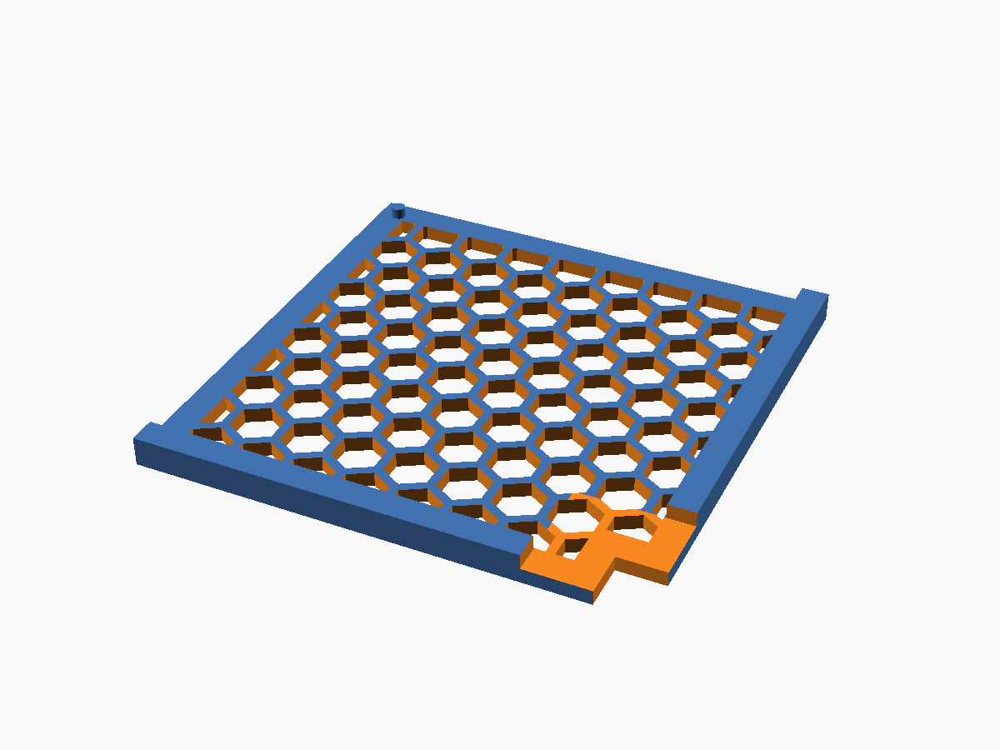
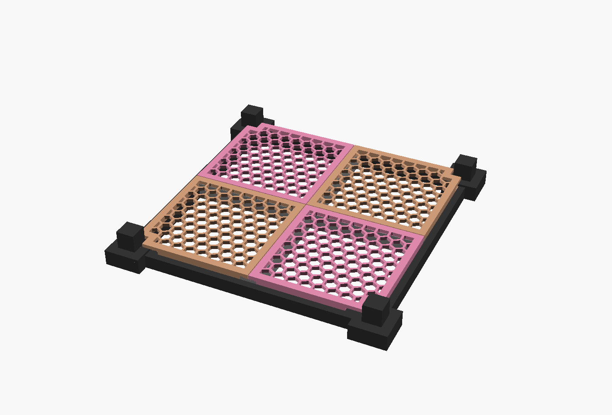

# filament-rack — honeycomb shelf for the modular tube frame

A parametric, HomeRacker-style **shelf kit** for one cell of the K.Flynn
"Modular Shelf System" frame (15 mm square-tube rails + corner/T connectors).
The frame builds a stackable cube grid but ships with **no shelving surface** —
this is that surface.

The cell opening (~255 mm) is as large as a 256 mm bed, so a one-piece tray that
rests on the rails can't fit. The shelf is therefore a **kit**:

| | |
|---|---|
|  |  |
| One quadrant tile | Brace + 4 tiles seated on a cell |

- **1 cross brace** (`+`) rests its four end-feet on the rails and spans the
  opening, dividing it into four quadrants. Print **×1**.
- **4 quadrant tiles**, each ~135 mm, rest on the **two perimeter rails** (outer
  edges) and the **two brace arms** (inner edges) — supported on all four edges.
  The honeycomb is one grid anchored at the cell centre, so the tiles are placed
  by **mirroring** (not rotation) and the pattern is **continuous across the whole
  cell**. That needs two mirror variants: print **`tile` ×2** and
  **`tile-mirror` ×2**.
- Tiles **peg onto the brace** so the surface acts as one rigid plate; container
  weight flows tile → brace/rails. Gravity / liftable.
- **Corner notches** clear the connector posts, so the frame still **stacks**.

## ⚠️ Measure your frame first

Caliper your assembled frame and set:

| Parameter | What to measure | Default |
|---|---|---|
| `inner_opening` | **bar INNER edge to bar INNER edge** across one cell | `255` |
| `rail` | rail tube cross-section | `15` |
| `post_notch` | square footprint of the corner connector post (+ a little) | `24` |
| `fit_clearance` | slip gap | `0.4` |

Each tile ≈ `inner_opening/2 + rail_rest` (≈135 mm) → fits the bed easily. The
brace arms span the full opening (~271 mm); `output="brace"` rotates it 45° so
its bounding box (~204 mm) fits a 256 mm bed.

## Print settings

- **Tiles:** floor-down, as exported — **no supports**. PLA/PETG, 3–4 walls,
  15–25% infill.
- **Brace:** as exported — flipped so the bearing face + end-feet sit flat on
  the bed and the beam stands up (no overhangs), rotated 45° to fit. A brim helps
  the tall walls stick. This is the load-bearing part; print it solid-ish
  (4+ walls). Increase `brace_depth` for stiffer/heavier shelves.
- Reference Z=0 is the rail top; tiles sit `bear` (4 mm) above it on the brace.

## Outputs

```bash
OSCAD="/Applications/OpenSCAD.app/Contents/MacOS/OpenSCAD"
# quadrant tile (print 2)
"$OSCAD" -D 'output="tile"'        --export-format binstl -o exports/filament-rack-tile.stl        filament-rack.scad
# mirror-image quadrant tile (print 2)
"$OSCAD" -D 'output="tile-mirror"' --export-format binstl -o exports/filament-rack-tile-mirror.stl filament-rack.scad
# cross brace (print 1, auto-rotated 45° to fit the bed)
"$OSCAD" -D 'output="brace"'       --export-format binstl -o exports/filament-rack-brace.stl       filament-rack.scad
# seated-on-frame preview
"$OSCAD" -D 'output="assembly"' -o exports/filament-rack-assembly.png filament-rack.scad
```

`exports/filament-rack.stl` is the earlier one-piece tray, kept only for size
comparison.

## Parameters (top of `filament-rack.scad`)

Grouped for the Customizer: **Frame fit**, **Tile**, **Cross brace**,
**Honeycomb**, **Output**.

## Credits / license note

The **frame** (rails, connectors, feet, clips in `Modular+Shelf_stls/`) and the
`HomeRacker - Shelf - v22.f3d` reference are third-party designs, kept here only
as references — not redistributed. This shelf kit is an original parametric
model inspired by the HomeRacker shelf concept.
