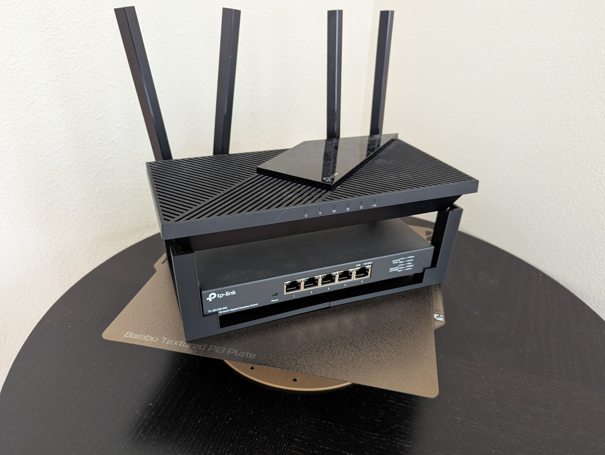
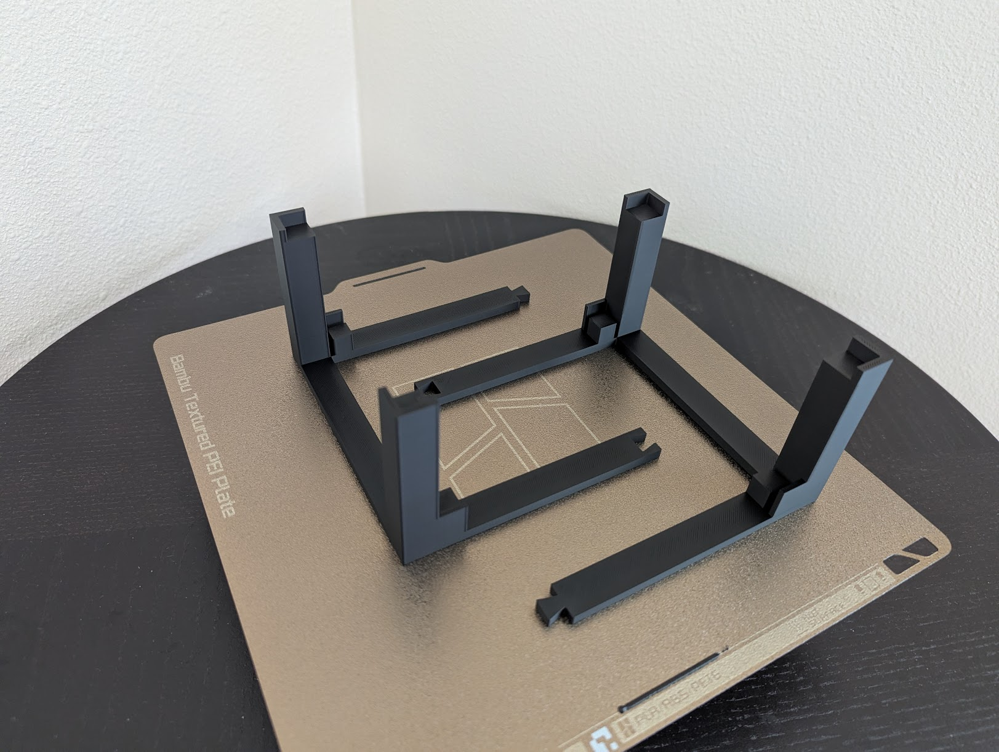

# Router Stand (2-piece connected frame)

Lifts the router off the shelf with a switch tucked underneath.
Sized for **router 231 × 125 mm** and **switch 210 × 125 × 27 mm** by default
(both adjustable at the top of `router-stand.scad`). Tolerance: **2 mm** all
around between the printed walls and the devices.



The two printed halves on the build plate, dovetails visible at the seams:



## Retention strategy

- **Router corners** — full L-cups at all 4 corners, 10 mm tall walls, catches the corner from outside.
- **Switch** — light retention (the user only wants a "stop", not a wrap):
  - X axis: the router posts' inner faces act as stops (~2 mm to either side of the switch).
  - Y axis: short tabs (15 mm tall) on the long rails at the switch's corner-X position, with 2.5 mm clearance to the switch.
  - The switch sits on 4 flat-top posts that elevate it `switch_gap_below` (10 mm) above the floor.
- **Halves locked together** — a trapezoidal dovetail joint on each long rail at the seam (X=0):
  - Top rail has a tenon (narrow at the seam, wider at the tip).
  - Bottom rail has a matching mortise.
  - 180° rotation puts the partner half's tenon/mortise on the opposite rail, so the joints mate.
  - Tenon-to-mortise clearance is `joint_clearance` (0.3 mm) for a snug-but-printable fit.
  - **Assembly: lower one half straight down onto the other from above** — the dovetail won't slide in horizontally because the wide tip can't fit through the narrow opening.

## Vertical stack

```
   router on 4 tall L-cups        ──┐
                                    ▼
   ┏━━━━━━━━━━━━━━━━━━━━━━━━━━━━━━━━━━━━━━━━━━┓
   ┃                                          ┃   ← 30 mm airflow gap
   ┃    ┌────────────────────────────────┐    ┃
   ┃    │            switch              │    ┃   ← 27 mm switch
   ┗━━━━┘                                └━━━━┛
        ▲ switch sits on 4 flat-top posts      ← 10 mm cable gap under
   ─────┼──────────────────────────────────────  ← floor (5 mm rails)
```

Total stand height ≈ 72 mm.

## Print

Full assembly footprint is ~244 × 135 mm — too big for a Bambu 256 mm bed if
you also need a brim. Default output is one **half** (122 × 135 mm), print 2
copies. The router and switch sitting on top hold the halves together — no
fasteners.

- Output options (top of file):
  - `output = "half"` — left half only (default)
  - `output = "full"` — whole stand in one piece (≥260 mm bed)
  - `output = "assembly"` — preview with ghost router + switch (don't print)
- Material: PLA or PETG
- Layer height: 0.2 mm
- Sparse infill density: **25%** (gyroid pattern) — load is mostly compression on 4 posts, 25% is plenty
- Wall loops: **3** — solidifies the thin 2.5–3 mm walls/tabs
- Top shell layers: 4 / Bottom shell layers: 3
- Supports: **none** — L-walls sit fully on top of posts, no overhangs
- Orientation: as oriented in the file (floor on bed, posts up)

Each half is ~122 × 135 × 80 mm. ~3–4 hours per half at these settings.

## Assembly

1. Print 2 copies of the half.
2. Place one as-printed for the LEFT side, floor flat on the shelf.
3. Rotate the other **180° about the vertical axis** and **lower it straight down**
   from above so the dovetail tenons drop into the matching mortises. The wide
   tips of the tenons then lock the halves against horizontal pull-apart.
4. Slide the switch onto the 4 elevation posts — the tabs catch its long edges.
5. Set the router on the 4 tall L-cups.

## Tuning for your hardware

Edit the variables at the top of `router-stand.scad`:

| Variable | Meaning |
|---|---|
| `router_length`, `router_width` | Router bottom footprint (rectangle) |
| `switch_length`, `switch_width`, `switch_height` | Switch dimensions |
| `switch_gap_below` | Cable space + airflow under the switch |
| `airflow_gap` | Heat exhaust gap between switch top and router bottom |
| `clearance` | Tolerance between printed walls and devices (default 2 mm) |
| `post_size`, `wall_height`, `wall_thickness` | Router L-cup geometry |
| `switch_post_size` | Switch elevation post cross-section |
| `tab_x_length`, `tab_thickness`, `tab_height` | Switch retention tab geometry |
| `rail_width`, `floor_thickness` | Floor-frame sizing |

The frame's long-axis size is auto-computed as `max(router-fit, switch-fit)`
so you don't have to balance the two constraints manually.

## Export

```bash
# half (default — prints on Bambu 256 mm bed)
openscad -o exports/router-stand-half.stl router-stand.scad

# full (only on ≥260 mm bed printers)
openscad -D 'output="full"' -o exports/router-stand-full.stl router-stand.scad
```
