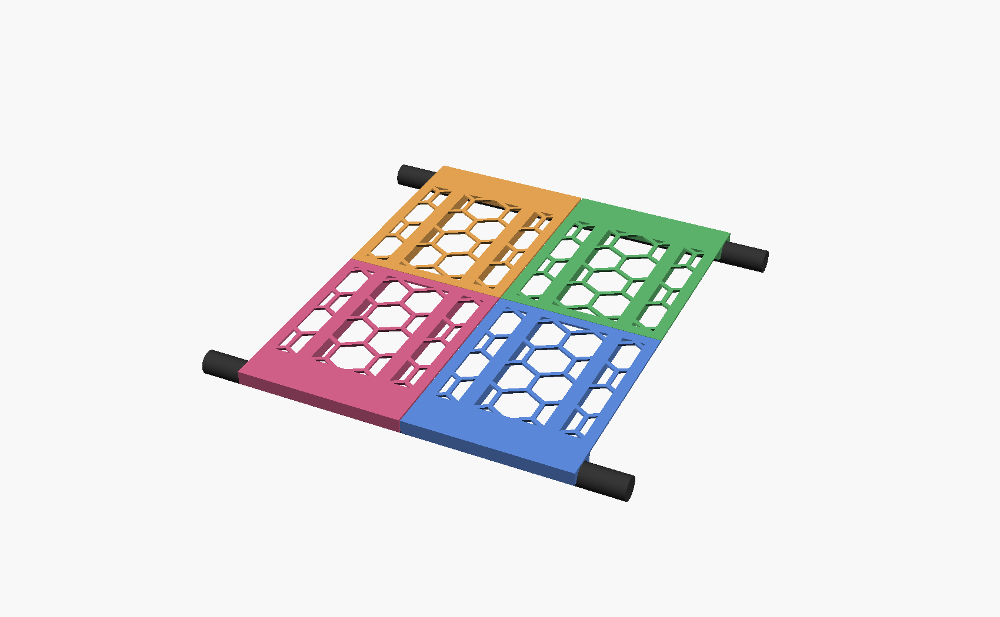

# Shoe-rack shelf

Replacement shelf for a tube-frame shoe rack whose woven fabric shelf tore. The
tier has two parallel **round bars** (16 mm dia, r = 8) running its length,
**251 mm apart** (inner face to inner face) and **930 mm long**. Printed
segments sit across both bars and tile along the length.



The deck is perforated over the three open bays (default **honeycomb**), keeping
solid strips over the rod ribs, a solid border, and solid bands over the saddles.
`deck_style` selects `"honeycomb"`, `"diagonal"`, or `"solid"`.

## Structure: two halves tied by two rods

The 251 mm gap is wider than the 256 mm bed, so each segment is two halves. A
half resting on only **one** bar would pivot about it and dump the shoe through
the gap, so the halves are tied into **one rigid plank** by **two rods
("sticks")**:

- Each half is a deck reaching its bar, with **rib channels running across the
  span** (toward the hangers). A **~180° cradle** drapes over the bar (rests on
  top, lift straight up to remove).
- **Two rods slide through both halves' aligned tubes.** They tie the halves and
  act as the support beam, carrying load **all the way to the hangers**. Being
  straight and stiff through both halves, the rods stop the seam from folding.
- The two halves are **identical** — print one part, rotate one 180° about
  vertical. They sit `seam_gap` (0.3 mm) apart at the centre so they mate cleanly;
  the sticks bridge the gap.

```
            shoe
   ┌───────────────────────────────┐   honeycomb deck (1.6)   Z = 8 .. 9.6
 ╭─┴─╮  ══════════════════════════  ╭─┴─╮  rod in rib tube    Z ≈ 3 (in rib)
 │(O)│  rib ──────────────────────  │(O)│  ~180° cradle        Z = 0 .. 8
 ╰───╯       (rod ties both halves)  ╰───╯  bar (r=8)           bar centre Z = 0
   bar ◄──────── 251 mm span (Y) ────────► bar
        half A │ push together │ half B   (rods bridge the seam)
```

## Sticks (printed PLA)

The sticks are printed PLA **rectangular bars** (`rod_w` × `rod_h`, default
3 × 4 mm) — not round rods. Rectangular bars print flat as a clean wall (no
overhang) and, standing tall in the rib, resist sag far better than a round rod
of the same footprint. The slot keys them upright. Print with `output="rod"`;
the bar lies flat on its side on the bed.

The stick only has to **bridge the seam** — it reaches `rod_reach` (default
110 mm) into each half, so the default stick is **219 mm** long. The ribs stay
solid the rest of the way to the bars, so the deck is supported all the way to
the hangers regardless of stick length.

Each segment uses **2 sticks**; the whole shelf (8 segments) uses **16**. If a
loaded shelf sags, raise `rod_h` (taller bar), `rod_reach` (longer grip), or
`rod_count`, then reprint.

## Print settings

The shelf is **8 segments** (tile ≈ 115 mm) so the two halves of a segment fit
side by side on one bed — **one plate = one complete segment** (2 tiles +
2 sticks), 8 plates for the whole shelf.

| Setting | Value |
|---|---|
| Material | PLA |
| Layer height | 0.2 mm |
| Walls / loops | 3 |
| Supports | **None** — deck face-down, ribs + cradle point up (stick slot bridges ~4 mm, fine) |
| Orientation | as exported — deck flat on the bed |
| Per plate | `shoe-rack-shelf-plate.stl` = one segment (2 tiles + 2 sticks), ≈ 233 × 163 mm |
| Pieces | **16 tiles + 16 sticks** (8 segments), all PLA |

Each printed half is **115 × 145 × 10 mm** — well inside the 256 × 256 bed.

## Assembly

1. Print **8 plates** of `shoe-rack-shelf-plate.stl` — each gives one segment's
   2 tiles + 2 sticks. (Or print `tile.stl` ×16 and `rod.stl` ×16 separately.)
2. For each segment: push **2 sticks** into one half (from the seam face) so they
   protrude, then **push the second half onto the protruding sticks across the
   span** until the decks meet — the sticks tie them into one rigid plank.
3. Lower the segment so each half's cradle drops over its bar. The saddles cap
   the stick ends so nothing slides out.
4. Repeat along the rack, segments butting end to end, to cover the 930 mm.

`shoe-rack-shelf-assembly.stl` shows **two assembled segments side by side**
so you can see how segments butt along the bars — it's a visual aid, not a print
(controlled by `preview_segs`).

## Tuning

| Section | Parameter | Controls |
|---|---|---|
| Bars | `bar_d`, `bar_gap`, `shelf_len` | **measure these on your rack** |
| Bars | `bar_clear` | slip gap between cradle and bar (0.6 mm) |
| Segmentation | `tile_count`, `tile_gap` | segments along the length / clearance |
| Deck | `deck_th`, `deck_style`, `border` | thickness, diagonal/honeycomb/solid, solid border |
| Deck | `seam_gap` | gap between the two halves at the centre seam (0.3 mm) |
| Holes | `hex_w`, `hex_web` | hole size and web between holes (both patterns) |
| Cradle | `cradle_wall` | saddle wall thickness beside the bar |
| Sticks | `rod_count`, `rod_w`, `rod_h` | number of sticks, width, height (stiffness) |
| Sticks | `rod_reach` | how far the stick reaches into each half (→ stick length) |
| Sticks | `rod_clear`, `rib_wall`, `cap_wall` | slot fit, rib wall, stop wall (rib is hollow beyond it) |

## Export commands

```bash
SCAD="/Applications/OpenSCAD.app/Contents/MacOS/OpenSCAD"
"$SCAD" -o exports/shoe-rack-shelf-plate.stl -D 'output="plate"' shoe-rack-shelf.scad
"$SCAD" -o exports/shoe-rack-shelf-tile.stl -D 'output="tile"' shoe-rack-shelf.scad
"$SCAD" -o exports/shoe-rack-shelf-rod.stl  -D 'output="rod"'  shoe-rack-shelf.scad
"$SCAD" -o exports/shoe-rack-shelf-assembly.stl -D 'output="assembled"' shoe-rack-shelf.scad
"$SCAD" -o exports/shoe-rack-shelf-assembly.png --imgsize=1600,1000 --colorscheme=Tomorrow \
  -D 'output="assembly"' shoe-rack-shelf.scad
```
